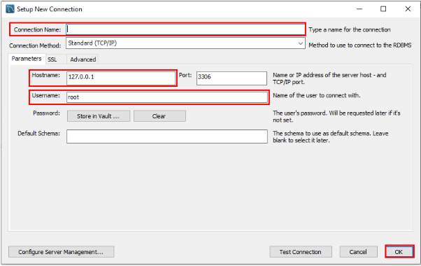
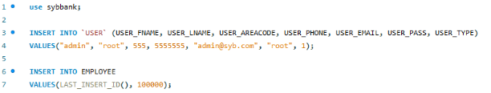

# CSI-3450 - SYB Bank

By Samantha Bracellari, Jakob Short, and Olivia Yee

This document will give you a run-through of everything that you will need to build and use our application. From the browser to the backend - it's all in this one cohesive file.

---

Before you can build this project, you'll have to install some packages and modules. Version numbers should not matter (unless they are explicitly specified) as long as they are either the latest version or the most recent LTS version.

## Browsers

- Since we are using `Selenium`, this project is set to run on `Mozilla Firefox`. Make sure you have that installed (the regular edition, not the developer edition).

## For the Frontend

- `NodeJS`
- `npm` - the Node package manager

## For the Backend

- `Python` version 3.7.xx
- `pip` - the Python package manager
- `flask` - a lightweight web framework for python
- `flask-cors` - to allow cross origin requests
- `selenium` - a browser web driver
- `geckodriver` - the driver for Firefox

Installation instructions are not provided as they will change depending on your operating system. Note however that if you're running Windows, you'll have to add Node and Python to your `PATH` if you don't already have them.

## For the Database

### Hosting the Database on AWS

#### Create/Sign in to Your AWS Account

We chose to host our database on AWS. Follow the steps below so that you can do the same.

1. To create or sign in to your AWS account, go to [Amazon Web Services](https://aws.amazon.com).
2. On the section named "Find Services", search for RDS (Relational Database Service) and select it.

3. In the section labeled "Create Database", select the "Create Database" button.

4. After you are brought to the create database page, select the following options

    a. Standard create  
      
    b. Engine type - MySQL  
      
    c. Version - MySQL 8.0.17  
      
    d. Templates - Free Tier  
      
    e. DB Instance Identifier - SYB Bank  
      
    f. Master password is your choice. DO NOT FORGET IT THOUGH.  
      
    g. Enable-storage autoscaling - Disable  
      
    h. Select the dropdown labeled "Additional connectivity configuration". Choose "Yes" for "Publicly Accessible", and create a new VPC security group named "SYB-Bank"  
      
    i. Enable automatic backups - Disable  
      
    j. Select "Create Database"  
      
5. From the RDS home screen, select your newly created database.  
  
6. Under "Connectivity & Security", select the VPC security group that was created  
  
7. Select "Inbound rules"  
  
8. Select "Edit inbound rules"  
  
9. Change and save the rule as follows:  
  
10. You are now successfully hosting the database on AWS!  

#### Download and Install MySQL Workbench

MySQL Workbench is the most convenient UI client to use to interact with the database. Follow the steps to install and configure it properly.

1. Download and install MySQL Workbench [here](https://dev.mysql.com/downloads/workbench/).
2. Open MySQL Workbench on your machine and select the (+) button by "MySQL Connections"

3. In the new window that appears:  
    a. Enter in a Connection Name (this is what the connection will be called in workbench)
    b. Enter your AWS endpoint into the "Hostname" text field
    c. Enter "admin" into the "Username" text field
    d. Select "OK"
    
4. Select your new connection from the "MySQL Connections" section and enter your password if prompted
5. Download the database folder in the root of this project
6. Drag the `initialization.sql` script from the Database folder into the window and execute it to initialize the database schema
7. To create the admin account, run the following queries:

    **NOTE:** This creates an admin account with email `admin@syb.com` and password `root`

8. Drag and execute the rest of the scripts in the Database folder (Functions and Procedures)
9. Your MySQL database has been initialized!

## How to Build

To build this project is quite simple. First, navigate into the `react` folder and run an `npm install`, and then an `npm start`. The first command will install any dependencies that are located in the `package-lock.json`, as well as dependencies of those dependencies. If this is your first time building the project, this might take a while. The second command will start up the frontend locally on port 3000 and open a browser with `localhost:3000`. You can close this window though, as the proper Firefox window will be opened upon successful startup of the backend.

To run the backend, simply navigate to the `Server` folder and run a `python main.py`. This will spin up a local server on port 5000 as well as open a new Firefox browser on `localhost:3000`. After that, the project should be running and ready for use!
